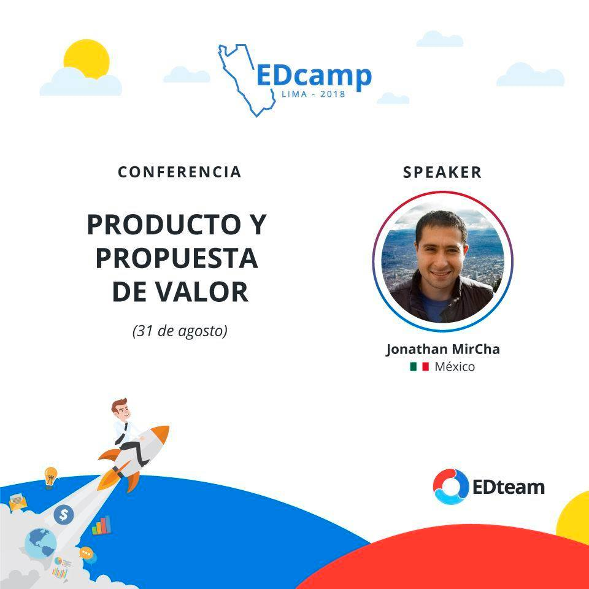

# EDcamp Lima 2018

#### Viernes 31 de agosto - Taller de emprendedores

## Producto y propuesta de valor

Todo emprendimiento comienza por un producto que debe satisfacer una necesidad y una propuesta de valor que haga a este producto atractivo para los posibles clientes.

#### [📰 Ver slides](https://docs.google.com/presentation/d/1SoF58WgBgCcXu3zdPMu44Uz2f_C7fWFQ3SsE1s6ZgfI/)

#### Sábado 01 de septiembre - Workshops

## Desarrollo web orientado a componentes con HTML, JS y PHP

Aprenderás las metodologías y prácticas de frameworks y librerías modernas orientados a componentes (React, Vue, Angular) con las tecnologías de siempre (HTML, JS y PHP).

### Justificación:

Actualmente adentrarse al maravilloso mundo de la web puede ser tormentoso, qué lenguaje, librería, framework, paradigma, base de datos, servidor utilizar entre el abanico inmenso de opciones... lo que es un hecho es que desde los inicios de la web HTML, JS y PHP siempre han estado ahí, y con ellos podemos seguir desarrollando con prácticas modernas, sin perdernos en el camino.

Si eres principiante, aprenderás metodologías modernas con tecnologías básicas y después, pasarte a cualquier librería o framework moderno por tu cuenta será muy sencillo.

Si tienes experiencia, cambiará tu visión sobre la elección de qué tecnologías usar en un proyecto y verás que muchas veces regresar a lo básico con prácticas modernas puede ser la mejor elección.

También puedes mirar el código de [**kEnAi Gulp Starter Kit**](https://github.com/jonmircha/kenai-gulp-starter-kit).
